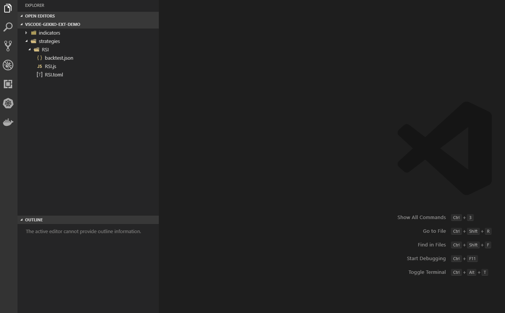

# vscode-gekko-ext

Jspare Cloud Gekko Strategy Builder for Vscode

> Extension made exclusively for [Jspare Cloud Gekko](https://github.com/jspare-projects/gekko), isn't compatible with `askmike/gekko`.



## Running the Extension

- Run `npm install` in terminal to install dependencies
- Run the `Run Extension` target in the Debug View. This will:
	- Start a task `npm: watch` to compile the code
	- Run the extension in a new VS Code window

## Installing

> *Note*: Currently this extension is not published over marketplace since the platform is in development. In the future as part of our requirement we want to expose the extension together with a new Gekko DSL.

It's required to have the `code` installed in your system, follow this instructions below:

> Your OS can not find the VS Code binary code on its path. The VS Code Windows and Linux installations should have installed VS Code on your path. Try uninstalling and reinstalling VS Code. If code is still not found, consult the platform specific setup topics for Windows and Linux.
> On macOS, you need to manually run the Shell Command: Install 'code' command in PATH command (available through the Command Palette ⇧⌘P). Consult the macOS specific setup topic for details.


**Installing from Build**

```bash
git clone https://github.com/jspare-projects/vscode-gekko-ext.git
npm i -g vsce
npm run package
code --install-extension ./vscode-gekko-ext.vsix
```

**Uninstallling**

```bash
code --uninstall-extension jspare-org.vscode-gekko-ext
```

**Publishing**

For further reference access the [API documentation](https://code.visualstudio.com/api/working-with-extensions/publishing-extension).

```bash
vsce publish
```

## Usage

Structure expected:

- example-strategy/
- example-strategy/example-strategy.js (Strategy)
- example-strategy/example-strategy.toml (Strategy Configuration Parameters) - OPTIONAL
- example-strategy/paper-trader.js (Paper Trader in TOML format) - OPTIONAL
- example-strategy/backtest.json (Backtest in JSON format) - OPTIONAL